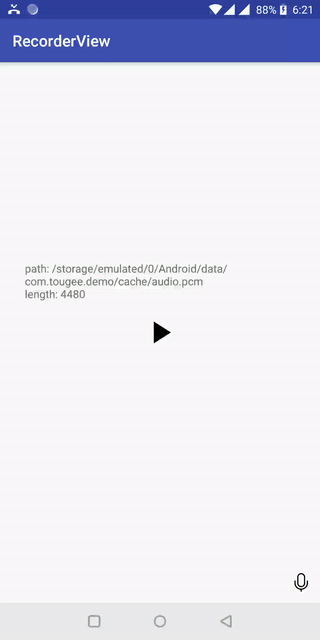

# AudioRecorderView

Simple Audio Recorder View with 'swap-to-cancel' Like Telegram



## Usage
```xml

    // AndroidManifest.xml
    <uses-permission android:name="android.permission.RECORD_AUDIO" />

    // layout include AudioRecordView
    <com.tougee.recorderview.AudioRecordView
        android:id="@+id/record_view"
        android:layout_width="match_parent"
        android:layout_height="wrap_content"
        app:mic_icon="@mipmap/ic_custom_mic"
        app:mic_active_icon="@drawable/custom_mic_active"
        app:mic_hint_enable="false"
        app:mic_hint_color="@color/custom_hint_color"
        app:mic_hint_text="@string/custom_hint_text"
        app:mic_hint_bg="@drawable/custom_hint_bg"
        app:blink_color="@color/custom_blink_color"
        app:circle_color="@color/custom_circle_color"
        app:cancel_icon_color="@color/custom_cancel_icon_color"
        app:slide_cancel_text="@string/custom_slide_cancel_text"
        app:cancel_text="@string/custom_cancel_text"
        app:vibration_enable="false"
        android:layout_alignParentBottom="true"/>

```
``` kotlin

        // activity implemented AudioRecordView.Callback

        override fun onCreate(savedInstanceState: Bundle?) {
            super.onCreate(savedInstanceState)
            setContentView(R.layout.activity_main)

            record_view.apply {
                activity = this@MainActivity
                callback = this@MainActivity

                micIcon = R.drawable.ic_chevron_left_gray_24dp
                micActiveIcon = R.drawable.ic_play_arrow_black_24dp
                micHintEnable = false
                micHintText = "Custom hint text"
                micHintColor = ContextCompat.getColor(this@MainActivity, android.R.color.holo_red_light)
                micHintBg = R.drawable.ic_launcher_background
                blinkColor = ContextCompat.getColor(this@MainActivity, R.color.color_blue)
                circleColor = ContextCompat.getColor(this@MainActivity, R.color.color_blink)
                cancelIconColor = ContextCompat.getColor(this@MainActivity, R.color.color_blue)
                slideCancelText = "Custom Slide to cancel"
                cancelText = "Custom Cancel"
                vibrationEnable = false
            }

            record_view.setTimeoutSeconds(20)
        }

        override fun onRecordStart() {}

        override fun isReady() = true

        override fun onRecordEnd() {}

        override fun onRecordCancel() {}

```

## Setup
### Android Studio / Gradle
Add the following dependency in your root build.gradle at the end of repositories:
```Gradle
allprojects {
    repositories {
        //...
        maven { url = 'https://jitpack.io' }
    }
}
```
Add the dependency:
```Gradle
dependencies {
    implementation 'com.github.tougee:audiorecorderview:1.0.4'
}
```

## License details

```
Copyright 2018 Touge

Licensed under the Apache License, Version 2.0 (the "License");
you may not use this file except in compliance with the License.
You may obtain a copy of the License at

	http://www.apache.org/licenses/LICENSE-2.0

Unless required by applicable law or agreed to in writing, software
distributed under the License is distributed on an "AS IS" BASIS,
WITHOUT WARRANTIES OR CONDITIONS OF ANY KIND, either express or implied.
See the License for the specific language governing permissions and
limitations under the License.
```